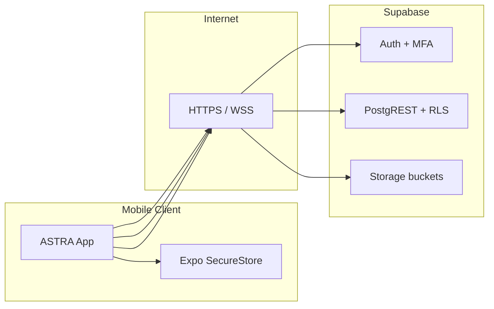

# ASTRA — Threat Model (Phase 4)

Academic deliverable aligned with Global Solution Cybersecurity requirements.

## 1. Critical assets

| Asset | Description | Impact if compromised |
|-------|-------------|------------------------|
| Operator credentials | Email/password, MFA secrets, JWT sessions | Account takeover, fraudulent incident reports |
| Mission & colony data | Operational metadata, membership | Mission integrity loss, unauthorized visibility |
| Incident records | Title, description, severity, GPS, attachments | False telemetry, privacy breach, operational deception |
| Supabase Postgres + Storage | System of record and file blobs | Data exfiltration, ransomware, service outage |
| Audit trail | `audit_events` for security monitoring | Undetected attacks, compliance failure |

## 2. Trust boundaries

## 3. Threat vectors (STRIDE-oriented)

### T1 — Stolen session / token replay

- **Threat:** Attacker reuses a leaked JWT or refresh token from device backup or logs.
- **Controls:** SecureStore (no AsyncStorage for tokens), short-lived JWT, sign-out invalidation, MFA (AAL2) for enrolled users.
- **Detection:** `auth.login` / `auth.logout` audit events; anomalous IP/device (future).

### T2 — Broken access control (IDOR)

- **Threat:** User reads or updates incidents outside mission membership.
- **Controls:** RLS on all tables; reporter can read own incidents; role-based policies; server-side validation of `reporter_id` / `actor_id`.
- **Detection:** `security.access_denied` audit action (client-side, future server triggers).

### T3 — Malicious attachment upload

- **Threat:** Oversized or wrong-type files; path traversal in storage keys.
- **Controls:** Authenticated uploads only; bucket policies; MIME/size checks in repository; storage path scoped by `incident_id`.
- **Detection:** `incident.attachment_uploaded` audit events.

## 4. Security controls summary

| Control | Implementation |
|---------|----------------|
| Least privilege | `app_role` enum + RLS per table |
| MFA | Supabase TOTP (optional, profile + login step) |
| Encryption in transit | TLS to Supabase |
| Encryption at rest | Supabase platform default |
| Audit logging | `audit_events` + `recordAuditEvent()` (best-effort) |
| Input validation | Zod schemas on forms |
| Error hygiene | `getUserFacingMessage` — no stack traces to users |

## 5. Residual risks

- Client-side audit is best-effort (not a legal-grade SIEM).
- GPS coordinates are sensitive (LGPD) — minimize retention and access in production.
- Pentest and dependency scanning are manual (see `PENTEST_CHECKLIST.md`).
